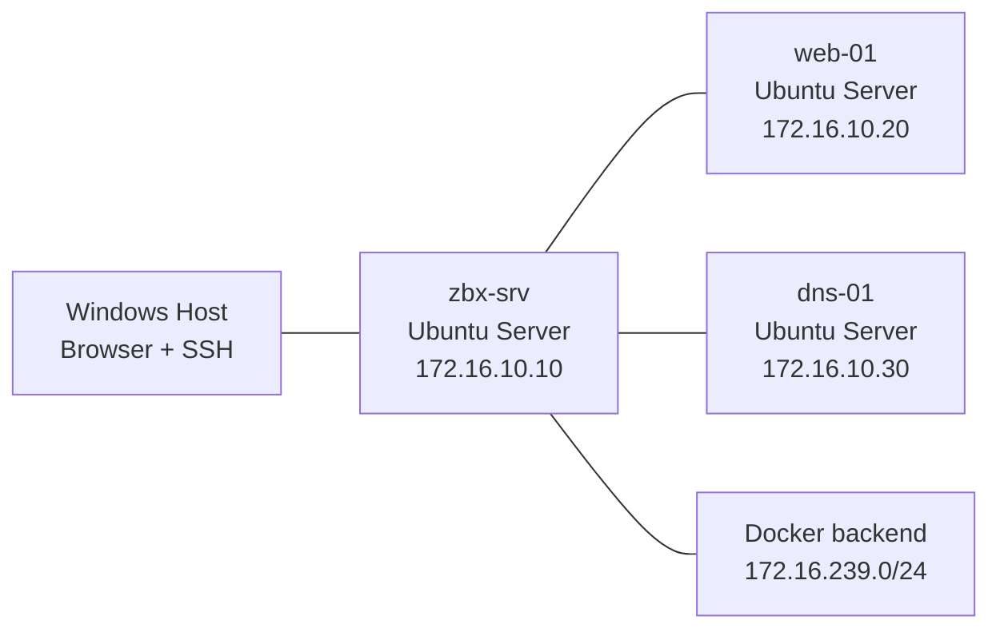

# Zabbix Incident Lab

Three-VM monitoring lab built around Zabbix 7.4, Ubuntu Server, Docker, and repeatable outage simulation.

This project documents a real home-lab setup where Zabbix runs in Docker on one Ubuntu Server VM and monitors two additional Ubuntu Server targets. The goal is not just deployment, but incident detection, validation, and troubleshooting.

## Scope

- `zbx-srv` runs Zabbix in Docker.
- `web-01` runs `nginx` and `zabbix-agent2`.
- `dns-01` runs `bind9` and `zabbix-agent2`.
- Zabbix frontend is opened from the Windows host via NAT port forwarding.
- Incidents are simulated manually over SSH by stopping services and changing network behavior.

## Topology



VirtualBox network layout:

- `Adapter 1`: `NAT`
- `Adapter 2`: `Internal Network` named `zbx-lab`

Inside the VMs:

- `enp0s3` = NAT
- `enp0s8` = internal lab network

More detail is in [docs/topology.md](docs/topology.md).

## VM Layout

| VM | Role | Lab IP | Services |
| --- | --- | --- | --- |
| `zbx-srv` | Zabbix server VM | `172.16.10.10/24` | Docker, Zabbix frontend, Zabbix server, MySQL |
| `web-01` | web target | `172.16.10.20/24` | `nginx`, `zabbix-agent2` |
| `dns-01` | DNS target | `172.16.10.30/24` | `bind9`, `zabbix-agent2` |

Docker network discovered during deployment:

- backend subnet: `172.16.239.0/24`

That subnet matters because passive agent checks from containerized Zabbix server come from the Docker bridge network, not directly from `172.16.10.10`.

## Working Configuration

`zbx-srv`

- Ubuntu Server 24.04
- Docker Engine
- official [`zabbix/zabbix-docker`](https://github.com/zabbix/zabbix-docker) repo on branch `7.4`
- frontend exposed inside the VM on port `80`

`web-01` and `dns-01`

- Ubuntu Server 24.04
- `zabbix-agent2`
- agent config allows both:
  - `172.16.10.10`
  - `172.16.239.0/24`

Example agent config:

```text
Server=172.16.10.10,172.16.239.0/24
ServerActive=172.16.10.10
Hostname=web-01
```

## Windows Access

Recommended NAT port forwarding:

| VM | Purpose | Host port | Guest port |
| --- | --- | --- | --- |
| `zbx-srv` | SSH | `2221` | `22` |
| `web-01` | SSH | `2222` | `22` |
| `dns-01` | SSH | `2223` | `22` |
| `zbx-srv` | Zabbix frontend | `8080` | `80` |

Frontend URL from Windows:

- `http://127.0.0.1:8080`

Authentication note:

- the initial default Zabbix password was changed after first login
- the current password is intentionally not stored in this repository

## Monitoring Implemented

Base host monitoring:

- `Linux by Zabbix agent` on `web-01`
- `Linux by Zabbix agent` on `dns-01`

Custom service monitoring:

- web scenario `web-home` on `web-01`
- trigger: `web-01 HTTP unavailable`
- simple check `net.tcp.service[tcp,172.16.10.30,53]` on `dns-01`
- trigger: `dns-01 DNS unavailable`

The `Zabbix server` default host in the container deployment may show an unnecessary agent alert if `Linux by Zabbix agent` stays linked. In this lab, that template should be removed from the container host and `Zabbix server health` kept.

## Incidents

Implemented and tested:

1. `web-01 HTTP unavailable`
2. `dns-01 DNS unavailable`

Planned next:

3. High latency / packet loss on `web-01`
4. Blocked port or interface down

Details are in [docs/incidents.md](docs/incidents.md).

## Results

Implemented and validated in the live lab:

- service-stop incident for `web-01`
- service-stop incident for `dns-01`
- passive agent troubleshooting for Docker-based Zabbix deployment

Captured evidence:

- [01-healthy-dashboard.png](docs/screenshots/01-healthy-dashboard.png)
- [02-web-http-unavailable.png](docs/screenshots/02-web-http-unavailable.png)
- [03-dns-unavailable.png](docs/screenshots/03-dns-unavailable.png)
- [04-resolved-state.png](docs/screenshots/04-resolved-state.png)

Note:

- some screenshots may still show the default container host alert for `Zabbix server`; the real project outcomes are the `web-01` and `dns-01` incidents

## Setup Summary

1. Create 3 Ubuntu Server VMs in VirtualBox.
2. Set `Adapter 1 = NAT`, `Adapter 2 = Internal Network`.
3. Configure static IPs on `enp0s8`.
4. Install `openssh-server` on all 3 VMs.
5. Install Docker only on `zbx-srv`.
6. Clone official `zabbix-docker` repo and run `docker compose up -d`.
7. Install `nginx` + `zabbix-agent2` on `web-01`.
8. Install `bind9` + `zabbix-agent2` on `dns-01`.
9. Allow `172.16.10.10` and Docker subnet `172.16.239.0/24` in `zabbix_agent2.conf`.
10. Add both hosts into Zabbix and configure service-specific checks.

## Repo Structure

```text
zabbix-incident-lab/
|-- README.md
|-- configs/
|   |-- ip-plan.md
|   `-- monitoring-matrix.md
|-- docs/
|   |-- incidents.md
|   |-- topology.md
|   `-- screenshots/
|       `-- README.md
```

## GitHub Notes

This repo should contain:

- lab documentation
- screenshots
- trigger expressions
- incident runbooks
- manually executed simulation commands documented in Markdown

This repo should not contain:

- full copies of the official `zabbix-docker` repository
- VM disk images
- secrets or private credentials

Safe-to-publish items in this repo:

- RFC1918 lab IP addresses
- hostnames used only inside the lab
- trigger expressions
- screenshots of Zabbix UI
